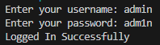
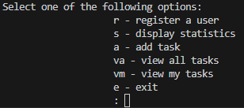

# DataScienceBootcamp
HyperionDev x Stellenbosch Uni data science bootcamp projects


Through this bootcamp I got do a few builds, which are listed below: 
| Build | Purpose | Learnings | Links | 
|------|---------|-----------|-----|
| Task Management System | Assign and organise tasks for an SME | Python syntax, error handling, debugging | [View the Code](https://github.com/mukelwe-m/DataScienceBootcamp/blob/ab4d43ebd2b869854721b23f694f117865d9244b/task_manager.py)|
| ML Models | Use different machine learning models|Linear Regression, Logistic Regression, Desision trees, etc.| [View the Code](https://github.com/hyperiondev-bootcamps/MM25010017606/blob/7d774a6550f9113e0cb1b86c4dba16247f197d4c/Level%202%20-%20Data%20Science%20Basics/L2T14%20-%20Capstone%20Project%20-%20Linear%20Regression%20in%20Action/Linear_Regression_Ames.ipynb)|
| NLP App |...| Unsupervised machine learning (K-Means Clustering) | ...|

# Task Management System 📋

A Python-based command-line task management application with user authentication and role-based access control.

## Features

- **User Authentication**: Secure login system with username/password validation
- **Role-Based Access**: Admin-only features for user registration and statistics
- **Task Management**: Create, view, and track tasks with due dates
- **Personal Dashboard**: Users can view tasks assigned specifically to them
- **Statistics Dashboard**: Admins can view system-wide metrics

## Usage

### For Regular Users:
- **a**: Add new tasks
- **va**: View all tasks in the system
- **vm**: View only your assigned tasks
- **e**: Exit the application

### For Admin Users:
All regular user options plus:
- **r**: Register new users
- **s**: Display system statistics

## Demo

### Login Screen


### Main Menu (Admin View)


### Registering a new user


### Viewing My Tasks

```
: vm
```


### Statistics (Admin Only)
```
: s

--- Statistics ---
Total Tasks:    12
Total Users:    5
```

## Installation

1. Clone the repository:
```bash
https://github.com/hyperiondev-bootcamps/MM25010017606/blob/main/Level%201%20-%20Python%20for%20Data%20Science/L1T15%20-%20Capstone%20Project%20-%20Files/task_manager.py
```

2. Ensure you have the required text files:
   - `user.txt` - Contains usernames and passwords (format: `username, password`)
   - `tasks.txt` - Stores all tasks (auto-created on first task addition)

3. Run the application:
```bash
python task_manager.py
```

## File Structure

```
task-management-system/
│
├── task_manager.py      # Main application file
├── user.txt            # User credentials storage
├── tasks.txt           # Task data storage
└── README.md           # This file
```

## Sample Data Files

**user.txt** (example):
```
admin, admin123
john_doe, password1
jane_smith, password2
```

**tasks.txt** (format):
```
username, task_title, task_description, date_assigned, due_date, status
```
## Requirements

- Python 3.x
- No external libraries required (uses standard library only)

## Future Enhancements

- [ ] Task editing and deletion
- [ ] Task completion marking
- [ ] Priority levels for tasks
- [ ] Search and filter functionality
- [ ] Export reports to CSV
- [ ] Password encryption
- [ ] GUI interface

## Author

Mukelwe Mdluli - [GitHub Profile](https://github.com/mukelwe-m)

---

**Note**: This is a learning project. For production use, implement proper password hashing and database storage.
